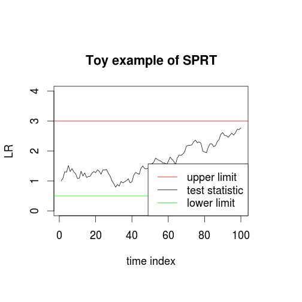
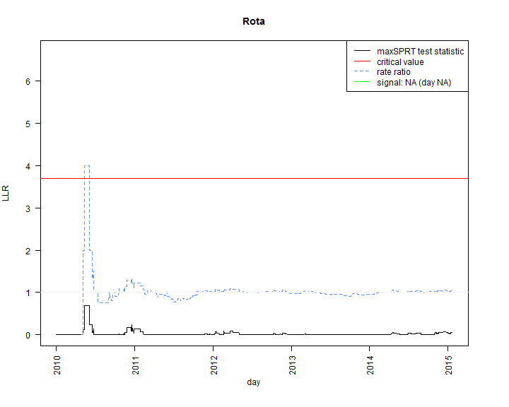
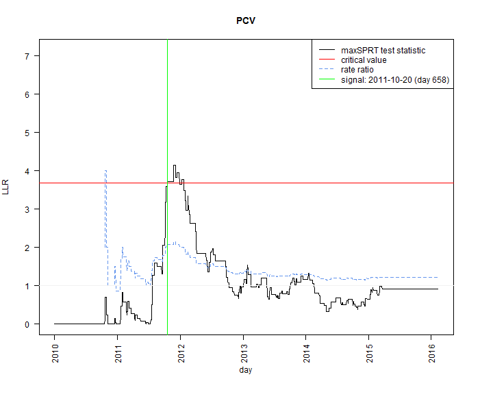
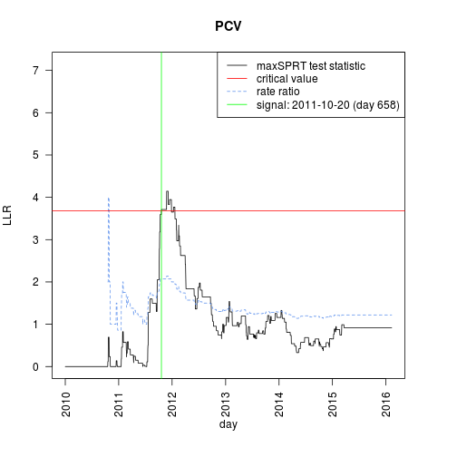

<!-- Intro -->

Vaccine safety surveillance and signal refinement
===================================================
transition: rotate
incremental: true

Tuomo A. Nieminen

Table of contents
===================================================
type: sub-section

1. Stages and goals of safety surveillance
2. Study designs
3. Sequential hypothesis tests
4. Safety surveillance methods (maxSPRT)
5. Application of maxSPRT to Finnish register data

<!-- Stages and goals of safety surveillance -->

1: Stages and goals of safety surveillance
===================================================
type: sub-section

Generating, refining and confirming information

Drug safety
===================================================

An adverse event is defined as an untoward medical occurrence in a patient administered a pharmaceutical product.

- Rare adverse events related to drugs are often impossible to detect in pre-licensure studies
- Therefore there is an incentive to monitor the safety of a drug post-licensure  
- This monitoring is called safety surveillance

 
  

Safety surveillance
===================================================

Safety surveillance involves generating, refining and confirming information of possible causal relationships between exposure and event pairs.

- Such information are called safety signals
- Here, the exposure of interest is a **vaccine** product and the events are some unwanted medical conditions (adverse events)
- Surveillance is preferably done in real time and with methods which minimize errors and the sample size

Three stages of surveillance
===================================================

Post-licensure safety aims can be classified into three stages:

1. **Signal identification**: Involves detecting unexpected adverse events and considers a large number of events
2. **Signal refinement**: Attempts to address a few specified hypothesis about suspected product-event pairs based on biological plausibility
3. **Signal confirmation**:  Involves a more in depth follow-up of a generated signal

We will concentrate on **signal refinement**.

Focus on the refinement stage
===================================================

A signal is information of a **possible** causal relationship between the exposure and the event.

- We will focus on safety surveillance in the signal refinement stage from a **methodological point of view** and assume that a biologically plausible exposure - event pair is already given
- The goal is to design a study and test for a statistical association between the exposure and the event. A signal is generated if an association is found.
- A safety surveillance method is a combination of data collection, study design and statistical hypothesis test(s)

Goals related to safety surveillance
===================================================

A natural goal of safety surveillance is to minimize false positive and false negative signals
- In statistical terms, minimizing false negatives is equivalent to maximizing power
- Since observations are unwanted events, another natural goal is to minimize the expected sample size
- Usually more samples lead to fever errors (higher power)...

  
  

  

How to achieve the goals?
===================================================
The goal is to minimize the errors and the sample size, but usually less samples lead to more errors. Things to concider:

- The study design should avoid biases in the sample to minimize errors
- The statistical test should make it possible to stop early if there is enough evidence of an association, while simultaniously keeping the error rates low

A solution is to use real-time monitoring and **sequential testing** where a hypothesis test is performed as often as possible. **Self-controlled study designs** can help to avoid biases.

<!-- Study designs -->

2: Study designs
===================================================
type: sub-section

  Avoid a biased sample

Options
===================================================

The following study designs could in theory be concidered for safety surveillance:

- **Cohort**: Groups of exposed and non-exposed individuals are followed forward in time. Incidences of events are compared between the groups.
- **Case-control**: Individuals with events are matched to individuals without events using variables such as age and gender. Proportions of exposure are compared.
- **Self controlled**: For each exposed individual, a risk interval and a non-risk interval is defined. Incidences during the intervals are compared

Self-controlled designs: an example
===================================================

- In self-controlled designs, the assignment to the case or control group depends on the time of the event
- Events during a risk period are classified as cases and events during a non-risk period as controls
- The case-crossover design (CCR) is a simple example of a self-controlled design

***

The study design matters
===================================================

Recent safety surveillance studies have generated multiple **false** positive signals (signals that could not be confirmed), due to:

1. **changes in coding**
2. **inappropriate control groups**
3. **uncertainty or changes in baseline incidence**
4. **Type I errors**.
  
Reason 4 relates to the statistical method used. Reasons 1-3 relate to the study design and they can be avoided with a self-controlled design.

Self controlled designs: properties
===================================================

The major weakness of the other designs is that confounders can affect the probability of exposure and result in bias.

- The risk of the above is minimal in a self-controlled design because each case essentially acts as their own control
- However, possible time varying confounders must be explicitly included in the model and the **selection of proper time intervals is crucial**
- The self-controlled designs retain relatively high power despite using little data (usually only cases)

The case-crossover design (1)
===================================================

Assume that events are independent and for each individual $i = 1, .., N$ events $k_{i,j}$ arrive at a constant rate $\lambda_{i,j}$ within the time interval $j  \in$ { *ctrl*, *case* }. Then

- $k_{i,j}$ ~ $Poi(\lambda_{i, j})$
- $\frac{\lambda_{i, ctrl}}{\lambda_{i, case}} = RR_i$ is the rate ratio

We will assume that the rate ratio is the **same for all** individuals,  $RR_i = RR$.

The case-crossover design (2)
===================================================
By conditioning on the total number of observations *n*, the distribution of the total number of cases $k$ no longer has any dependency on the baseline incedences.

$$ k | n \text{ ~ } Bin(n, p = \frac{RR}{z + RR})$$

$$\text{where } z=\frac{length(ctrl)}{length(case)}$$

- This is typical for the self-controlled designs: The **individual incidences cancel out** from the statistical model. For this reason the design is said to implicitly control for all non time-varying confounders.

The case-crossover design (3)
===================================================
incremental: false

<small>*The outcome of an event classified as a case or a control is a Bernoulli trial. The probability of the outcome depends on the lengths of the risk and non-risk intervals.*</small>

Study design conclusions
===================================================

Ultimately all epidemiological study designs do the same thing: compare some group of individuals to another group of individuals

- In self-controlled designs the assignment to the case or control group depends only on the time of the event
- Hence in self-controlled designs it is impossible to have non time-related selection bias in the case or control groups
- Therefore using a self-controlled design **can help to minimize errors** in safety surveillance

<!-- Sequential hypothesis testing -->

3: Sequential hypothesis testing
===================================================
type: sub-section

  Minimize the sample size  

General terms and definitions
===================================================
incremental: false

- $H_0$ is the null hypothesis
- $H_1$ is the alternative hypothesis
- $\alpha = P$(reject $H_0$ | $H_0)$ is the type I error (false positive)
- $\beta =  P$(accept $H_0$ | $H_1 )$ is the type II error (false negative)
- $Power = 1 - \beta$
- $RR$ is the rate ratio (defined in section 2)
- Simple hypothesis: $H_1: RR = 1$
- Composite hypothesis: $H_1: RR > 1$

How to minimize the sample size?
===================================================

In the setting of vaccine safety surveillance, every observation is some unwanted event. 

- Therefore there is incentive to minimize the expected sample size when an association exists
- This is can be achieved by utilizing the data as often as possible
- A procedure called the sequential probability ratio test (**SPRT**) minimizes the expected sample size when testing two simple hypothesis
- SPRT is a **sequential hypothesis test**

A sequential hypothesis test
===================================================

Generally, a sequential test of a statistical hypothesis is a test procedure which gives a rule of making one of three possible decisions at a single trial of the experiment:

  1. **Accept** $H_0$
  2. **Reject** $H_0$
  3. **Continue** the experiment by making an additional observation.

Sequential hypothesis testing was developed by Abraham Wald during the II World War.
  
Sequential probability ratio test (1)
===================================================

The sequential probability ratio test (SPRT) is the **most powerfull** sequential test for testing two simple hypothesis. 

- SPRT reduces the expected sample size by ~50% compared to a regular hypothesis test with similar error rates
- SPRT uses the likelihood ratio $LR$ as the test statistic

$$LR = \frac{L(RR | H_1)}{L(RR | H_0)}$$ 

- The likelihood function $L()$ is a function of the interesting parameter (RR) and it contains the statistical model for the observations

Sequential probability ratio test (2)
===================================================

- The test statistic (LR) is calculated whenever a new observation arrives. 
- The test statistic is then compared to critical values to make a desicion
- High values are critical to the null hypothesis.
- If the test statistic exceeds a boundary, the test terminates with a decision

***

Setting the hypothesis for safety surveillance
===================================================

When the objective is to find evidence of an association between an exposure and an event, the null proposition is a state of no association.

- The most natural alternative hypothesis however is composite: some positive association. This can be stated with the rate ratio $RR$ as follows:
- $H_0: RR = 1$
- $H_1: RR > 1$

In this case an extension of SPRT called the **maxSPRT** can be used to perform sequential hypothesis testing.

maxSPRT
===================================================

maxSPRT is a sequential hypothesis test which uses the maximized likelihood ratio as a test statistic. 

  $$LR = max \frac{L(RR > 1)}{L(RR = 1)}$$

- maxSPRT uses **one critical value $c$**: if at any point $LR \geq c$, then $H_0$ is rejected
- maxSPRT uses an **upper boundary N** on the sample size: if $n > N$, then $H_0$ is accepted.

The desicion rule of maxSPRT
===================================================

More formally the maxSPRT test proceeds as follows:

1. First define a critical value $c$ and an upper boundary for the sample size $N$
2. After observation $i = 1, .., N - 1$ do
  - if $LR_i \geq c$ stop, reject $H_0$
  - otherwise continue
3. After observation $N$ do
  - if $LR_N \geq c$ stop, reject $H_0$
  -  otherwise accept $H_0$

    
The critical values of maxSPRT
===================================================

SPRT type tests solve the problem of multiple testing by concidering the joint distribution of the test statistic.

- The critical value $c$ is computed such that the total probability of generating a false positive signal is some defined $\alpha$:

$$P(LR_i \geq c \text{ for some } i = 1, .., N) = \alpha$$

- Computing the critical values of the test is tricky and requires further research for most statistical models
- For the **binomial** and Poisson models a solution exists. A Markov chain approach can be applied in the binomial case.

Data accumulation matters
===================================================
The SPRT type statistical tests assume that the null hypothesis is tested at **every** new observation.

- If this assumption is not met, the critical values of the test should be affected
- If data becomes available in groups, **group sequential methods** should be used instead
  - If the size of the groups is known, the solution for computing the critical values of the test is similar to the SPRT type tests
  - If the size of the groups is random, approaches such as alpha spending should be used instead

Sequential testing: conclusions
===================================================

SPRT type sequential testing is only suitable if **new data is available often enough** because it assumes that the test can terminate at every new observation.

- The performance of sequential tests is optimized when all available data is utilized as frequently as possible
- Sequential testing can **reduce** the expected sample size by ~50% compared to regular hypothesis tests with similar error rates
- The chosen upper limit $N$ in maxSPRT affects the power and the critical value of the test (higher $N$ -> higher power and higher $c$)

<!-- Safety surveillance methods -->

4: Safety surveillance methods
===================================================
type: sub-section

Combining a study design and statistical hypothesis testing

Continuous safety surveillance
===================================================

A safety surveillance method can be viewed as a combination of

- **data collection**
- **study design**
- **statistical hypothesis test(s)**.

We will assume that data is actively collected and accumulates as a **stream**, making it possible to use sequential testing. The goal is to **refine** an identified signal.

Binomial maxSPRT (1)
===================================================

By combining a self-controlled design and a maxSPRT sequential hypothesis test, we get a safety surveillance method called the Binomial maxSPRT (**B-maxSPRT**).

- The likelihood function is

$$L(RR |n, k, z) = \frac{n!}{k ! (n - k)!}  \cdot (\frac{RR}{z + RR})^k \cdot (\frac{z}{z + RR})^{n - k}$$
  
- The likelihood ratio test statistic is

$$LR = max \frac{L(RR > 1 | n, k, z) }{L(RR = 1| n, k,  z) }  = \underset{RR>1}{max} \frac{ (\frac{RR}{z + RR})^k \cdot (\frac{z}{z + RR})^{n - k} }{ (\frac{1}{z + 1})^k \cdot (\frac{z}{z + 1})^{n - k}  }$$

Binomial maxSPRT (2)
===================================================
For computational reasons, it is conventient to operate with the log likelihood ratio instead. 

- Maximizing the log likelihood ratio can be done by finding the maximum likelihood estimate for the parameter $RR$
- Since we are not interested in cases where $RR < 1$, we should use $\hat{RR} = max\{1, \frac{z \cdot k}{n - k} \}$, and so

$$LLR = log(LR) = log \left( \frac{ (\frac{\hat{RR}}{z + \hat{RR}})^k \cdot (\frac{z}{z + \hat{RR}})^{n - k} }{ (\frac{1}{z + 1})^k \cdot (\frac{z}{z + 1})^{n - k} } \right)$$

Exploring the properties of maxSPRT
===================================================
incremental: false

You can experiment with the performance of maxSPRT with the [maxSPRT Shiny-app](http://shiny.app.thl.fi/maxSPRT/), available in the THL intranet.

- Binomial and Poisson models
- Computations for power and expected time to signal for user defined target populations
- Implementations for simulated data

<a href="http://shiny.app.thl.fi/maxSPRT/" target = "_blank">

</a>

Safety surveillance methods: conclusions
===================================================

A safety surveillance method is a combination of data collection, study design and hypothesis testing.

- By combining a simple self-controlled design with maxSPRT sequential testing, we get the B-maxSPRT surveillance method for stream type data
- Critical values for the test statistic can be computed using a Markov chain approach implemented in the Sequential R-package
- The Sequential package can also be used for power calculations

<!-- Application of B-maxSPRT -->

Application of B-maxSPRT
===================================================
type: sub-section

exposure: PCV, Rota or MPR vaccination  
event: Fever seizures  

About the experiment
===================================================

In this application, B-MaxSPRT was retrospectively applied to Finnish register data. We pretend as if we are observing new data daily.

- **Exposure**: PCV, Rota or MPR vaccination
- **Events**: fever seizure related hospitalizations
- It is established that MPR vaccination causes acute fever seizures. This relationship has also been shown using the Finnish register data.

B-maxSPRT was **expected to generate** a signal related to MPR, but not PCV or Rota.

Data
===================================================
The vaccinations of interest are the first doses of MPR, PCV and Rota vaccinations for children under 2 years of age born during 2010 - 2014. 

- For the MPR group, the 2014 cohort was excluded because the expected age at vaccination is higher and no sufficient data was yet available.
- The possible adverse events of interest are hospitalizations with <a href='https://terho.thl.fi/wiki01/display/rokobiom/Case-series+analyysi'>icd-10 diagnosis codes related to fever seizures.</a>

ICD-10 codes
===================================================
incremental: false

The following icd-10 codes were considered:

- **A**. A858 *Other specified viral encephalitis*, A86 *Unspecified viral encephalitis*, A87 *Viral meningitis*, A88 *Other viral infections of central nervous system, not elsewhere classified*
- **G**. G038 *Meningitis due to other specified causes*, G039 *Meningitis, unspecified*, G04 *Encephalitis, myelitis and encephalomyelitis*, G05 *Encephalitis, myelitis and encephalomyelitis in diseases classified elsewhere*
- **R**. R291 *Meningismus*, R55 *Syncope and collapse*, R560 *Febrile convulsions*, R568 *Other and unspecified convulsions*

Age intervals and observation periods
===================================================
For both vaccinations and hospitalizations, age intervals that cover first dose vaccinations of the chosen vaccines were considered: 
- MPR: 250 -  650 days
- Rota: 30 - 140 days
- PCV: 60 - 200 days

The case interval is **1-14** days after vaccination and control interval **15-42** days after vaccination. This includes an assumption that the possible effect of the vaccination is transient.

Surveillance conditions (1)
===================================================
The safety surveillance method used was B-maxSPRT. The parameters $N$, $c$ and $\alpha$ were defined as:
- $N$: This was taken to be the expected number of events during the retrospective time period (2010-) under $H_0$ for each age group, according to an estimated baseline incidence.
- Type I error (false positive) probability was chosen to be $\alpha = 0.05$.
- $c$: Exact critical values were computed using the Sequential R-package

Surveillance conditions (2)
===================================================
incremental: false

Below are the parameters which define the stopping conditions of the maxSPRT method for each vaccine group.

|     |   N|    c| power| alpha|
|:----|---:|----:|-----:|-----:|
|MPR  | 380| 3.78|  0.92|  0.05|
|ROTA | 258| 3.69|  0.80|  0.05|
|PCV  | 253| 3.68|  0.79|  0.05|

The power is calculed using an assumed rate ratio of 1.5.  

Surveillance results, MPR
===================================================

Surveillance results, Rota
===================================================

Surveillance results, PCV
===================================================

Surveillance results summary
===================================================
incremental: false

A signal was generated for MPR and PCV and not generated for Rota.

 

|     |signal |day  |  LLR| cases| controls|   n|   RR|
|:----|:------|:----|----:|-----:|--------:|---:|----:|
|MPR  |TRUE   |1381 | 3.80|   102|      142| 244| 1.44|
|Rota |FALSE  |1850 | 0.08|    89|      169| 258| 1.05|
|PCV  |TRUE   |658  | 3.71|    29|       28|  57| 2.07|
 

Notably the signal generated for PCV came with relatively low $n$ concidering the number of days passed.

More surveillance results, MPR
===================================================

More surveillance results, PCV
===================================================

Surveillance conclusions
===================================================
The surveillance method generated an expected signal related to MPR, but also an unexpected signal related to PCV
- However, further surveillance showed that when using all the available data, the estimate of the rate ratio for the PCV group was close to 1 (1.22)
- Therefore the signal related to PCV is likely to be a type I error, which were expected to occur 5% of the time for each exposure event pair.

Thank you!
===================================================
type: sub-section

Literature
===================================================
incremental: false

- Jennison (2000): Group Sequential Methods with Applications to Clinical Trials
- Kulldorff (2011): A Maximized Sequential Probability Ratio Test for Drug and Vaccine Safety Surveillance
- Leite (2016): Near Real-time Vaccine Safety Surveillance Using Electronic Health Records - a Systematic Review of the Application of Statistical Methods
- Maclure (1991): The Case-Crossover Design: A Method for Studying Transient Effects on the Risk of Acute Effects
- McClure (2008): Comparison of Epidemiologic Methods for Active Surveillance of Vaccine Safety
- Nelson (2015): Methods for Observational Post-licensure Medical Product Safety Surveillance
- Wald (1945): Sequential Tests of Statistical Hypothesis

<!-- EXTRA MATERIAL -->

<!-- Strengths and weaknesses: the cohort design -->
<!-- =================================================== -->
<!-- | -->

<!-- **Strengths** -->
<!-- - Utilizes the most available data -->
<!-- - Can provide an estimate of the baseline incidence -->
<!-- - Controls for time-varying confounders such as age and seasonality -->

<!-- *** -->
<!-- | -->

<!-- **Weaknesses** -->
<!-- - Confounders can affect the probability of exposure and result in in bias -->
<!-- - If the exposure rate is high, the unexposed group will be small -->

<!-- Strengths and weaknesses: the case-control design -->
<!-- =================================================== -->
<!-- | -->

<!-- **Strengths** -->
<!-- - Needs little data specially with rare events -->
<!-- - Controls for time-varying confounders such as age and seasonality -->

<!-- *** -->
<!-- | -->

<!-- **Weaknesses** -->
<!-- - Confounders can affect the probability of exposure and result in bias -->
<!-- - ( Finding suitable matches might be difficult ) -->

<!-- Strengths and weaknesses: the self controlled design -->
<!-- =================================================== -->
<!-- | -->

<!-- **Strengths** -->
<!-- - Implicitly controls for all non time-varying confounders -->
<!-- - Can use data only on events so needs little data -->
<!-- - Does not need a baseline estimate -->

<!-- *** -->
<!-- | -->

<!-- **Weaknesses** -->
<!-- - The choice of the risk and control periods plays a crucial role -->
<!-- - ( Time-dependent confounders such as age and seasonality must be explicitly included in the model ) -->

